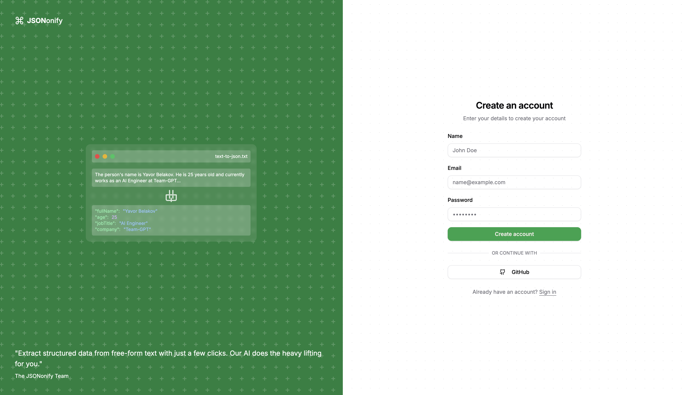
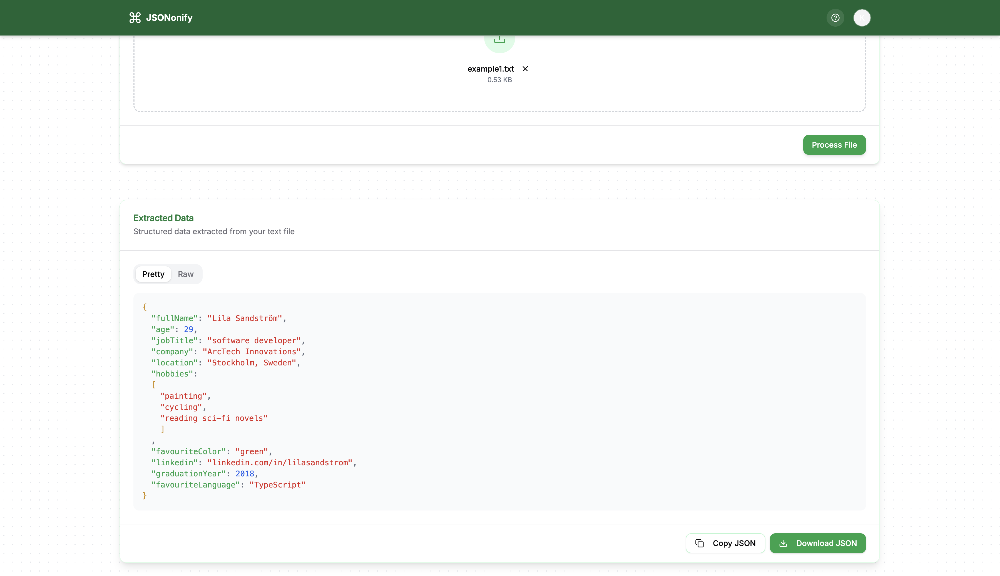

# 🤖 AI JSON Visualizer

A powerful web application that uses AI to extract structured data from text files and visualize it in a beautiful JSON format. Built with the T3 Stack and modern web technologies.

## ✨ Features

- 🔐 **Authentication**: Secure login with email/password and GitHub OAuth
- 📤 **File Upload**: Drag-and-drop or click to upload .txt files
- 🤖 **AI-Powered**: Extracts structured data using advanced AI models
- 🎨 **Beautiful UI**: Clean, modern interface with shadcn/ui components
- 📊 **JSON Visualization**: Interactive JSON viewer with copy and download options
- 📱 **Responsive Design**: Works seamlessly on all devices
- 📈 **Analytics**: Track usage with PostHog integration
- 🔍 **SEO Optimized**: Better visibility in search engines

## 🚀 Tech Stack

- **Frontend**: Next.js 14, TypeScript, Tailwind CSS, shadcn/ui
- **Backend**: tRPC, Prisma, PostgreSQL (Neon)
- **Authentication**: NextAuth.js
- **AI Integration**: Vercel AI SDK
- **Analytics**: PostHog
- **Package Manager**: pnpm

<!-- Screenshots -->

Project Link: [https://ai-json-visualizer.vercel.app](https://ai-json-visualizer.vercel.app)
